# Speaker Recognition using Spectral Analysis and ML - Design History File
By [Riccardo El Hassanin](https://github.com/rccrd27), [Adam Horsler](https://github.com/horsada), [Sebastian Gillman](https://github.com/SebGillman), [Xixian Huang](https://github.com/heyinwong) and [Ibrahim Mohamed](https://github.com/ibzmo)

 

## Table of content
1. [Introduction](./README.md#Introduction)
2. [Project Structure](./README.md#project-structure)
    1. [Gantt Chart](./README.md#gantt-chart)
    2. [Flowchart](./README.md#flowchart)
3. [Exploratory Data Analysis](./README.md#exploratory-data-analysis)
    1. [Problem Formulation](./README.md#problem-formulation)
    2. [Initial Approach](./README.md#initial-approach)
    3. [Data Acquisition](./README.md#data-acquisition)
    4. [Data Preprocessing](./README.md#data-preprocessing)
    5. [Model Selection](./README.md#model-selection)
    6. [Model Training](./README.md#model-training)
    7. [Final Model Architecture](./README.md#final-model-architecture)
    8. [Model Evaluation](./README.md#model-evaluation)
    9. [Summary](./README.md#summary)
4. [Inference Algorithm](./README.md#inference-algorithm)
    1. [Database](./README.md#database)
    2. [Algorithm](./README.md#algorithm)
    3. [Testing](./README.md#testing)
5. [Microcontroller Implementation](./README.md#microcontroller-implementation)
    1. [Microcontroller Selection](./README.md#microcontroller-selection)
    2. [Microcontroller Configuration](./README.md#microcontroller-configuration)
    3. [Inference on Microcontroller](./README.md#inference-on-microcontroller)
6. [Optimization](./README.md#optimization)
    1. [Cloud Optimization](./README.md#cloud-optimization)
    2. [Model Optimization](./README.md#model-optimization)
7. [Ethics and Sustainability](./README.md#ethics-and-sustainability)
    1. [Ethics](./README.md#ethics)
    2. [Sustainability](./README.md#sustainability)

 

## Introduction

This document serves as the Design History File of Group 16’s project. The goal of the project was to develop a near real-time speaker recognition Machine Learning (ML) product on a microcontroller. The input is a person’s voice, and the output is a prediction of the name of who that speaker is (if they exist in the database). 

The applications of our product are quite open to interpretation by the user. We have developed a speaker recognition platform that could be incorporated into larger applications such as a foundation for a basic voice assistant or a voice enabled security system (either on a small scale with local database or company-wide with a cloud based database). The product has features that enable a versatile number of use cases.

The software is available on this GitHub repository, which can be used to view the complete software development history of the project. The data used for training and testing includes a combination of public datasets and the group’s own. The group’s own dataset can be found here the GitHub folder named `TrainingDataGen`. The product should be functional on all microcontrollers that meet the minimum specification as outlined in the Hardware section, however development and testing was only conducted on a Raspberry Pi 4, thus this is the recommended microcontroller for guaranteeing reproducible results. 

 

## Project Structure

### Gantt Chart
The project involved 7 weeks of development and the group followed the Agile development process, which includes several “sprints” with varying end goals to achieve the final product. 

The Gantt chart below illustrates these sprints and how the project advanced, from start to finish, across the 7 weeks of development. 

  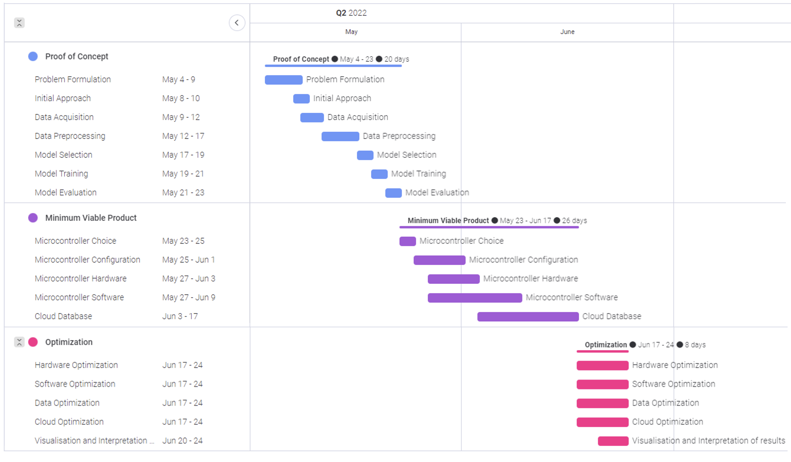

### Flowchart
The flowchart below shows how the various components of the product interact with each other. 

  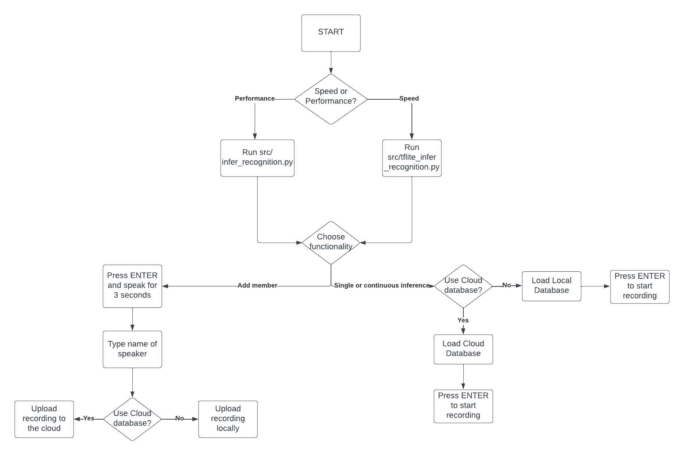

 

## Exploratory Data Analysis

### Problem Formulation
Discussions were held between the group and client, who was a representative from ARM. The initial functional and non-functional requirements were given to the group and are outlined in the table below.

|     Functional                                                     |     Non-functional                                                           |
|--------------------------------------------------------------------|------------------------------------------------------------------------------|
|     One-word specific   speaker recognition accuracy of 80%        |     Minimize storage and   computation capacity while maximizing accuracy    |
|     Latency of <3 seconds per prediction                           |     Cloud-enabled features                                                   |
|     Microcontroller-isolated   environment for input and output    |     Maximize portability between microcontrollers                            |

###	Initial Approach
The first component of the project involved experimenting with the group’s own dataset in [`TrainingDataGen`](./TrainingDataGen/Training) and understanding the type and quantity of data required for a successful product. The Colab Notbook `GroupProject.ipynb` contains the initial attempt to create a solution.

For speaker recognition, the spectrogram of each audio has to be obtained. A spectrogram is a visual representation of the change in distribution of energy among different frequencies over time.  They contain rich information as their various shapes displayed reveal the features of voice. For example, they can be used to distinguish the natural frequencies of people's tones. 

Image recognition has seen major advances in accuracy and practicality thanks to the introduction of convolutional neural networks. As the spectrograms are treated as images, the group focused on CNN ML models. The Keras framework was used to define and compile each model due to its inherited compatibility with TensorFlow.

The initial approach was to create a classification CNN that would distinguish the group members by extracting and analysing the features from the spectrograms created. The architecture consisted of three 2D convolutional layers, each followed by a batch normalization and max pooling layer. The output layers involve two dense layers in order to classify the 5 group members in the dataset during training. The model was trained with a sparse categorical cross-entropy loss in order to differentiate the speakers in the training set. 

As seen in the picture below, it is evident that the model learns the training set well as its loss decreases rapidly, from ~3.5 at epoch zero to ~0.25 at epoch 5. However, the validation loss does not decrease, and even increases on some epochs. This suggests that the model suffers from overfitting, a condition whereby a model begins to learn the noise in the data as opposed to the underlying features.

  

When the trained model was experimented on the test set, the group found that it struggled to learn the patterns necessary for speaker recognition as a result of the overfitting. This is shown in the bar chart below. Despite correctly classifying the speaker as “Riccardo”, the other members in the database “Adam” and “Xixian” also achieved high scores. Ideally, only “Riccardo” would have a high prediction score.
 

  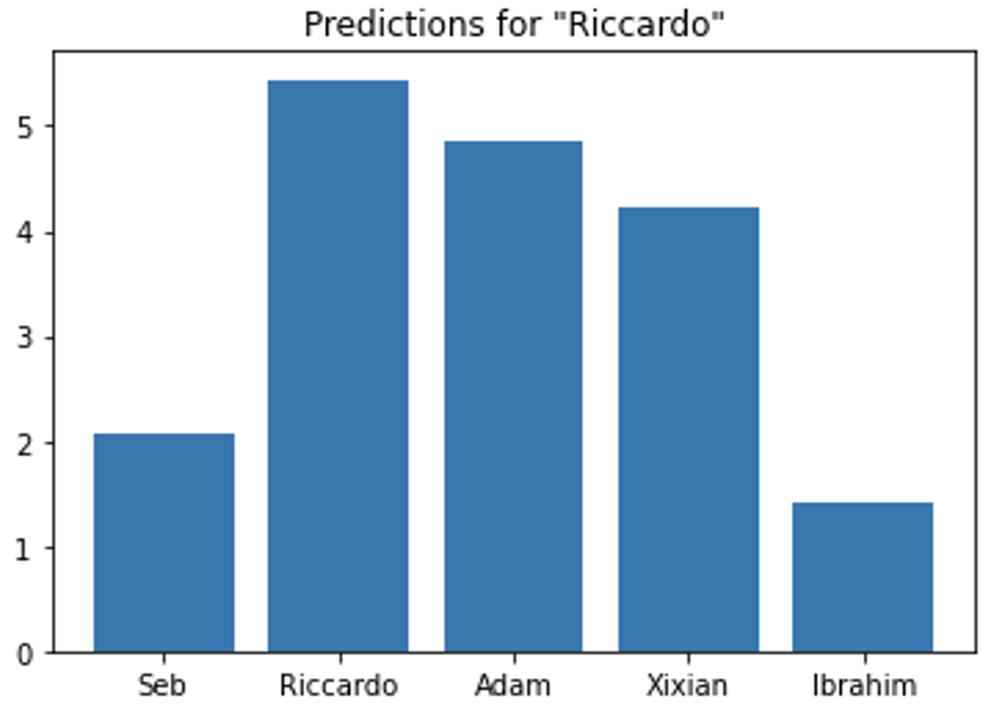

A huge flaw that was observed with this method is that it would require retraining each time a new user was added. This CNN model is more for a classification purpose and is used to classified only group members.

A new method was drawn up where voice feature extraction would be learned on a larger dataset using a more complex CNN. This feature extraction method would allow the recognition of a new user to be performed after registering them with just one voice sample.

### Data Aquisition

After the initial experimentation, the group decided to expand the dataset used for training and focused on a combination of public datasets, for example the [Speech Commands dataset](https://arxiv.org/abs/1804.03209)[1] and [zhvoice corpus](https://github.com/fighting41love/zhvoice) [2] , and the [group’s own dataset](./TrainingDataGen/Training) [3] . The format of all speech datasets must be encoded using the Waveform Audio File Format (WAV). This is because WAV files do not lose any information when it comes to frequencies on the sound spectrum. 

The group has decided to combine the zhvoice corpus dataset with our own group dataset, which resulted in a total of 3253 people’s speech data. These audio files add up to around 900 hours in total and are clips of voice samples at maximum of 3 seconds. The different speakers are labelled into different integers, in the range of 0-3252.

As the zhvoice corpus contains audios in MP3 format sampled at 16kHz, we have created a python script `create_data.py` that converts all the audios to WAV format. 

Additionally, the program creates a `.txt` file containing a list with the file path to each audio and its corresponding classification label (the unique ID of the speaker). This data list is mainly for the convenience of passing each labelled voice through the pre-processing and training process. 

Below are three example of waveforms from the group dataset

  

### Data Preprocessing
With the data list created, the spectrogram of each audio can be obtained. A spectrogram is a visual representation of the change in distribution of energy among different frequencies over time.  They contain rich information as their various shapes displayed reveal the features of voice. For example, they can be used to distinguish the natural frequencies of people's tones. 

The preprocessing of the WAV audios has multiple stages to make it more suitable and faster to process for the ML model. It was discussed whether to use linear-frequencies, mel-frequencies spectrograms or mel-frequencies cepstral coefficients spectrograms as they are more used in speech recognition, but after a first round of testing it was decided that linear-frequency spectrograms were satisfactory enough to extract the voiceprint of the speakers. 

Therefore, the waveforms are converted into linear-frequency spectrograms using Short Time Fourier Transforms (STFT). The APIs used for this task are `librosa.stft()` and `librosa.magphase()`. This can be shown in the python script `src/utils/reader.py`.

During training, data augmentation methods such as random flip stitching, random cropping, frequency masking are used. After processing the data, spectrograms with the shape of 257x257 are obtained. 

Finally, the spectrograms are split into training and test sets, with a 90:10 ratio. Two example spectrograms are shown in the figures below:

  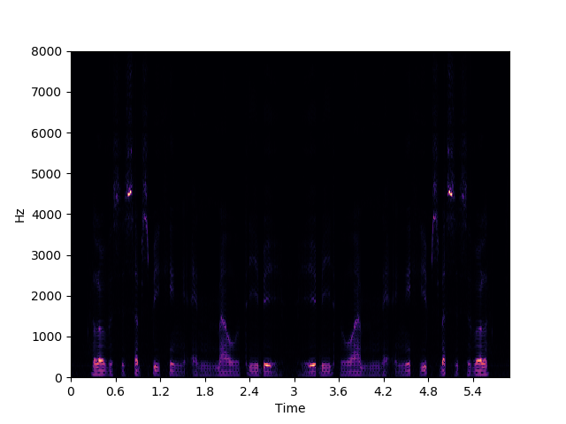
  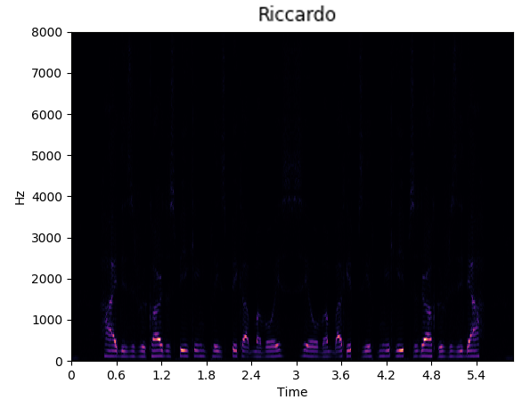 

The specification of preprocessing data samples is listed in the table below:

| Argument                      | Value        |
|-------------------------------|--------------|
|     Sample   Rate             |     16000    |
|     Frame   length            |     0.025    |
|     Window   length           |     400      |
|     Frame   stride            |     0.01     |
|     Hop   length              |     160      |
|     Spectrogram   length      |     257      |
|     Length   of FFT points    |     512      |

When using `create_data.py` to process mp3 audio files into wav format, the code also removes samples that are below 1.3 seconds. This is because on the subsequent data preprocessing stage, each audio they are all converted using short time fourier transfer. As shown on the table above, we have a sample rate of 16k, window length is 400 with a separation (hop length) of 160. Since the input shape is 257x257, the least time required to process transform is 1/16000*(400+160*256) = 2.585 seconds. When preprocessing the data, the audios are flipped and concatenated, so the least speaking duration should be half, which is 1.3 s. 
### Model Selection
When looking to decide what network architecture would be best in order to fulfil our design specification, it was clear that the initial architecture was not suited to deal with larger datasets as it requires retraining. In addition, it contains the problem of over-fitting when samples are not enough. When comparing different well-known CNN architecture in Computer Vision we found that ResNet50 would be the best model for use case given its features. As shown in Figure 5, the ResNet50 architecture is made from ‘residual blocks’. These blocks introduced skip connections, which in allowing the gradient to backpropagate easily allow for the allow for the training on large datasets with a lower complexity than other architectures such as VGGNet. Thus, we chose for it be the model for our use case.

  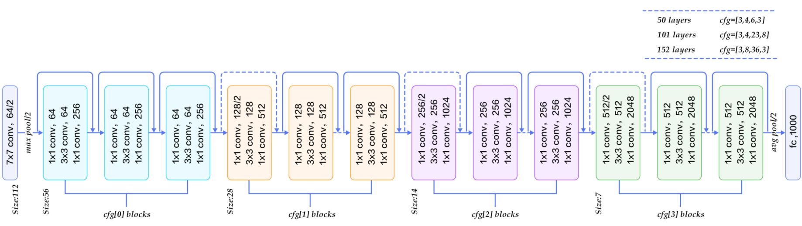

### Model Training
After processing the data into 257x257 spectrograms, we fed them into our Resnet50 network. As seen in `src/train.py`, the data input layer is [None,1,257,257] which matches the shape of spectrograms. For training, we use a stochastic gradient descent optimizer with a learning rate is 0.001 and the number of epochs is set to be 50. The loss function chosen is Additive Angular Margin Loss (ArcFace Loss). This loss function is used to normalize the features vector and weights, making the predictions only depend on the angle between the feature and the weight where an additive angular margin penalty m is added to θ (angle between weights and the features)

  

Overall, the ArcFace loss helps the model to maximize the margin which is the decision boundary on the hyperplane. It obtains discriminative features for speaker recognition and helps the model to calculate the geodesic distance between features on the hyperplane.

A dense layer with 3252 classes was added at the end of the ResNet5o model, in order to classify the 3253 people in the dataset during training. The following pictures showcase the training accuracy and loss of the model over 50 epochs.

  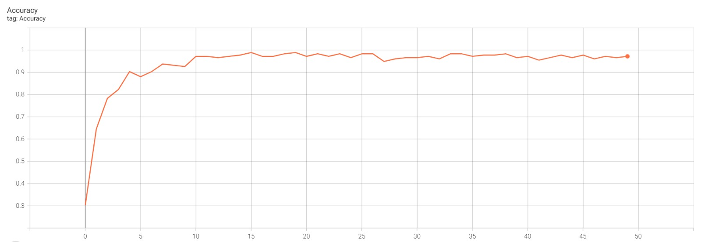
  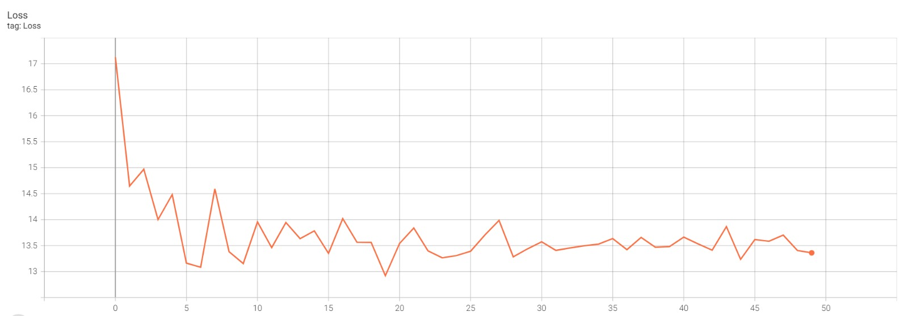 

During training the script will also create a ‘model_weight.h5’ file after every epoch. This can be used to resume training from the latest checkpoint. After training a `.h5` model is saved containing the the fully trained model that can be used later on. 
### Final Model Architecture 
Since features extraction from the spectrograms is an invaluable stage of the recognition process, the final dense layers of the ResNet50 are removed as they were used to classify those 3253 people during training. For the inference algorithm, the previous layers of the model are used as they extract the relevant features of the inputs. The final architecture for the Resnet50 is shown below: 

  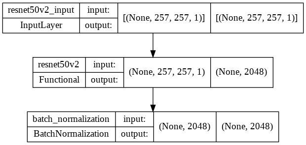

When visualizing the output of the last latent layer, the group found that the input images are mapped to a higher-dimension hyperplane and resulted in clusters-like forming of the features of speakers who pass the model. This was visualized using the t-SNE dimensionality reduction technique as it is well suited for non-linear mappings, whereas techniques like Principal Component Analysis (PCA) can only use linear mappings. The 2D result of the t-SNE dimension reduction technique is shown in the Figure below (note: only the group member’s voices are displayed for easier visualization). 

  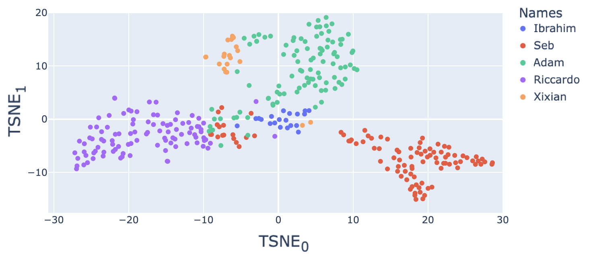

From the Figure, some voices have more distinct features, so they can be better distinguished than others. For example, red, purple, and green samples are well clustered, whereas orange isn’t. 
### Model Evaluation
After training, the program `src/eval.py` was used to evaluate the trained network in terms of accuracy. Since the CNN is used to extract the audio features, they can be used to determine the similarity between each voice in the test set. A cosine similarity metric is employed to perform pairwise comparisons between each audio feature vector in the hyperplane and determine the distance for how close those voices are from each other. It is defined as shown below where A and B are two feature vectors under comparison.

  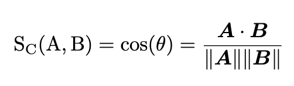

If the program outputs a high cosine similarity above a certain threshold, it indicates that those features are from the same speaker and thus if the labels are identical then the person speaking is indeed the same and the trained model was successful. Therefore, the program sets multiple thresholds to determine at which value the best accuracy of the model is achieved. 

`src/eval.py` will output the accuracy for the trained network and the best threshold needed to be set to achieve the greatest accuracy on the test set. It was found that the accuracy of the model on the test set is above of 90% when the threshold was set to 0.8. This threshold value is used in the subsequent speaker recognition algorithm.

### Summary
Exploratory Data Analysis has shown the proof-of-concept of speaker recognition using ML with a clearly defined implementation, from input to output. By finetuning the ResNet model, the salient features of the input spectrograms can be learned effectively, allowing a high-grade generalization to the user’s database. 

For the Resnet model, it is more robust than the custom one. As it is trained on a large dataset and the concept is to learn how to extract features from voice, there is no overfitting for the whole dataset. 

 

## Inference Algorithm
### Database
Given that a cosine similarity metric is used to determine the similitude between two feature vectors of two speaker voices, one of those two audios must be labelled for the recognition algorithm to output the name of the speaker.  Therefore, a local database for the user’s members is created. The user’s voice will be recorded and stored in the folder `audio_db/` which will serve as the local database in the embedded device. 

This allows the users to register new members in the database without having to re-train the whole model to classify them. Therefore, with the following recognition algorithm, the user can recognize a new voice immediately after registering it in the database, thus allowing for a custom-tailored database. 
### Algorithm
The speaker recognition algorithm developed can be found in `src/infer_recognition.py`. At the initialization of the program, it firstly loads the audios of the registered users from the database and, for each element, produces the corresponding spectrograms. These are fed into the trained CNN model and the significant features are extracted. The program then adds the extracted features and labels of each audio to the arrays, ready for comparison. 

After the program is initialized, the user can speak into the microphone and record his/her voice for a total of 3 seconds – as seen in `src/record.py` the library used to record the speakers is `pyaudio` and uses a sample rate of 16kHz (the same as the dataset inputs used for training). The recording is converted to a spectrogram and the features are then extracted using the trained CNN model. 

The algorithm then calculates all the cosine similarities between the feature vector of the audio to be recognised and each of the feature vectors of the audio files in the database. It chooses the highest similarity value to output and a prediction is made depending on whether the similarity is above or below the set threshold of 0.8. If the cosine similarity is above the threshold, it indicates that those features are from the same speaker, which means it recognizes that the one currently speaking is one of the members in the database. Otherwise, if the output is below the threshold, it shows that the current speaker is treated as a different person who is not inside the database. The figure below showcases the above algorithm. 

  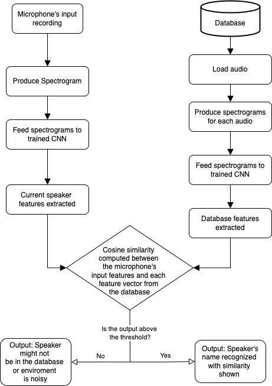

### Testing
To evaluate the algorithm, we tested it with each group member ten times and recorded the results. The Confusion Matrix below gives an example of some of the results obtained by the group during testing:

  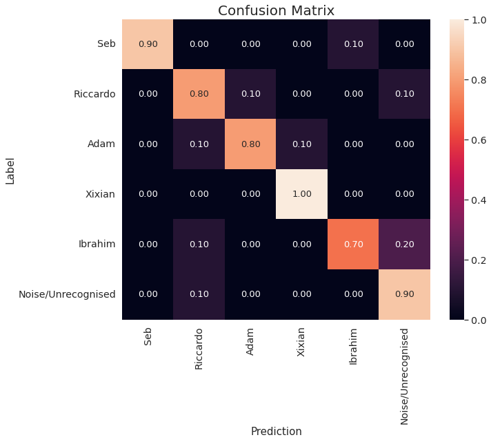

In addition to the above quantitative results, the group was able to gather key qualitative results. Firstly, if someone were to register his voice by saying only one word, for instance a quick “hello”, then the algorithm would not be able to pick up his voiceprint. This is because it was previously mentioned that the speaking time should be at least 1.3 seconds long in order to be able to extract relevant features. Secondly, when a person deliberately was speaking faster than its recorded sample or not in his true tone, the algorithm was mistakenly classifying it as another person or was unregistered. Thirdly, the proximity of the microphone was a factor influencing the output: If it is too close the recorded audio would be clipped and if it is too far the speaker would just blend in with the background noise. 

The next task is to transfer the algorithm to the Raspberry Pi.

 

## Microcontroller Implementation
### Microcontroller Selection
The group had a choice of microcontrollers to develop the product on. The primary choices were a Raspberry Pi 3/4 and the Nvidia Jetson. However, due to Nvidia Jetson supply issues, it was decided that development would be done on the readily available Raspberry Pi 4. 

The Raspberry Pi 4 was chosen due to its generous hardware specifications when compared to other models, for example the 8GB RAM, 16GB Memory, WiFi port and most notably a 64-bit quad core ARM CPU. This allows for rapid development and prototyping. 

After completing the functional requirements, the group would then optimize the product to run on the minimum configuration possible (or a configurable setup such that the user can choose depending on their specific use case). 

### Microcontroller Configuration
The Raspbian OS comes pre-installed with many of the necessary packages. However, to enable fast python environment configuration, the GitHub repo contains the file `requirements.txt` which lists the python packages to install. In addition, for some packages specific versions are specified, for example `numpy==1.19.2`, where 1.19.2 is the version number. This is to guarantee compatibility between the packages. 

The `pip` python package installer can facilitate automatic installation of all packages on the Linux command line using: `pip install -r requirements.txt`. A screenshot of the requirements text file is found in Appendix A for reference. 

The Raspberry Pi must be configured to correctly detect and use the microphone attached to the USB port. The GitHub repo also includes helper files to facilitate this setup, for example `device_details.py`, which lists on the command line all the devices the Raspberry Pi has detected. 

Finally, the Keras model must be uploaded into the `models/` folder on the Pi. It is recommended to use the Keras save and load API, which results in a `.h5` model file that contains all the necessary model information.

Once the system-level software is configured, it is ready for use.  

### Inference on Microcontroller 
To perform the recognition of the speaker on the microcontroller, run `src/infer_recognition.py` using `python3 infer_recognition.py`. This is the main point of entry functionality for the product. The program initially loads the trained CNN inference model and the database. Once the program has successfully finished initializing, the user will be prompted with a choice of three commands: 
 * 0: Add a user to the database
 * 1: Perform single inference
 * 2: Perform continuous inference

To add a user, select `0: Add a user to the database`. On first use, the database is empty. Therefore, it is expected that the user adds a person(s) to the database before performing inference. Once the necessary steps are followed as described in the flowchart in section 1, the user’s voice will be recorded and stored in the Pi in the folder `src/audio_db/` and the program will return to the post-initialization state. 

The `1: Perform single inference` and `2: Perform continuous inference` commands allow the user to employ the speaker recognition algorithm outlined in [Algorithm](./README.md#algorithm) section.  

Single inference will take a 3 second recording and attempt to match the extracted features form the recording to a voice in the database using cosine similarity. If it is successful and the cosine similarity is above the threshold parameter (set as 0.8 in `src/infer_recognition.py`), it will return the name given to that user. If unsuccessful, it will return a message stating that either the environment is too noisy, or the user is not in the database.

Continuous inference is an extension of single inference as it runs the inference pipeline in a while loop until interrupted. It therefore will take continuous 3 second recordings and continuously attempt to infer who is speaking in those 3 seconds. This recognition mode happens in near real-time as the classification time of each recording is on average 1.3 seconds. This is because the microcontroller takes around 0.2 seconds to produce the spectrograms and 1.1 seconds to extract the features using the trained CNN model. 

 

## Optimization

### Cloud Optimization
After confirming functionality by storing speaker recordings on the Pi, the group decided to implement an optional cloud storage solution. This will enable the Pi to act as an IoT device if required by the user as it can upload and download recordings to the cloud. The user will then decide on each inference whether they would like to access the local database or the cloud database. This is to preserve potential desired properties of the product, notably security as opening the Pi to the internet (although through a secure HTTPS connection) may not be suitable in some use cases. 

Amazon Web Services (AWS) was chosen as the cloud solutions provider due to the group’s previous knowledge, however any cloud provider would be acceptable. There are utility and helper functions located in `src/AWS`, which all use the boto3 Software Development Kit (SDK) as recommended by AWS. 

When running `src/infer_recognition.py`, during doing recognition or registering new members to the cloud database, a temporary folder will be created as `temp/`. This is for storing the temporary audio data when accessing the cloud. It separates the audioes in the cloud database to the ones in local database in `audio_db/`. The folder is deleted once finished.

### Model Optimization
Once the basic functional requirements were met, there were optimizations that could be done on the model. Due to the low-cost aspect of the product, the group chose to optimize the model in such a way as to reduce the size and increase its speed while maintaining sufficient levels of accuracy. These goals resulted in several different optimizations being applied. 

The h5 model size is 96457 KB and is large considered it is imported to a microcontroller. In terms of pursing faster processing time and smaller size, the group considered converting the model from `.h5` format to a `.tflite` model using the program `src/quantizer.py`. Tflite model is optimised as it reduces the latency of the prediction, size, and even lower power consumption.

However, the main drawback of using a converted tflite model on pi is its loss in precision. When operating the tflite model, it outputs extreme high similarity on every sample and resulted in higher cases of mispredictions. Converting h5 model to tflite model is a trade-off between speed and accuracy. Overall, the group decided to keep using the h5 model.

 

## Ethics and Sustainability
### Ethics
Many machine learning problems have fundamental ethics considerations related to the data they use and the consequences of their solutions. For speaker recognition, the data is by definition people's voices. This poses an identity risk if a third party were to gain access to these voices. However, the product has various features to limit this risk 

Firstly, giving the user the option to store data locally ensures that if desired, avoid the risk of exposing to the internet. In addition, all processing of their voice is done locally, effectively rendering the Raspberry Pi into an isolated environment. Secondly, giving the user the choice of what to name their recording gives flexibility against using Personally Identifiable Information (PII). For example, instead of using their full name, a user could use an ID number. PII is heavily regulated and thus this consideration is required when using the product.  

### Sustainability
The Raspberry Pi in general as a microcontroller is energy efficient when compared to other machine learning systems, for example data centers with many high-power General Processing Unit’s (GPU’s). In terms of storage, the waveforms and spectrogram file sizes are small (as they must be suitable for storage on the Pi!). 

In terms of product upgrades as technology advances, all the code and environments use technologies that are currently in active development and maintenance, allowing for easy upgrades. In addition, as the hardware and software are essentially platform independent, hardware upgrades should be simple. 

### References 

[1] - P. Warden, "Speech Commands: A Dataset for Limited-Vocabulary Speech Recognition", arXiv.org, 2022. [Online]. Available: https://arxiv.org/abs/1804.03209. [Accessed: 01- Jul- 2022].

[2] - D. Wang and X. Zhang, "THCHS-30 : A Free Chinese Speech Corpus", arXiv.org, 2022. [Online]. Available: https://arxiv.org/abs/1512.01882. [Accessed: 01- Jul- 2022].

[3] - S. Gilman, I. Mohamed, R. El Hassanin, A. Horsler and X. Huang, "SpeakerRecognitionGroupProject", GitHub, 2022. [Online]. Available: https://github.com/SebGillman/SpeakerRecognitionGroupProject/tree/main/TrainingDataGen/Training. [Accessed: 01- Jul- 2022].
